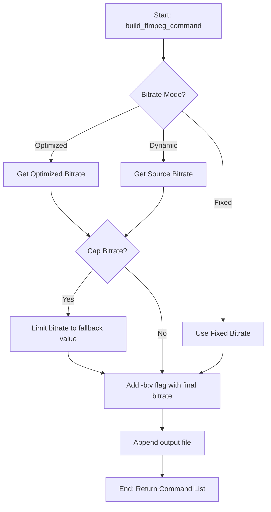
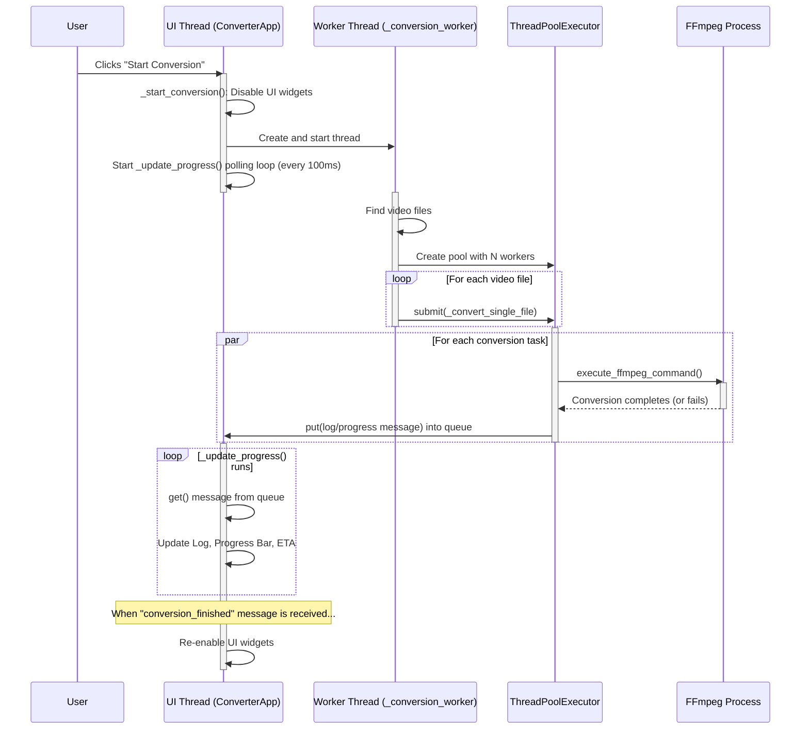

# FFMPEG Bulk Converter GUI - Code Explanation

This document provides a detailed breakdown of the source code for the FFMPEG Bulk Converter GUI application. It is intended for developers to fully understand the methods, logic, dependencies, and execution patterns of each major component.

---

## 1. `requirements.txt`

### 1.1. Purpose
This file lists the Python packages required for development and packaging of the application.

### 1.2. Dependencies
- **`pytest`**: A framework for writing and running tests. It is used to ensure the reliability of the conversion logic.
- **`pyinstaller`**: A tool used to package the Python application (`.py` scripts) into a standalone executable (`.exe`) for Windows, so that users do not need to have Python installed.

---

## 2. `generate_spec.py`

### 2.1. Purpose
This is a utility script for developers. Its sole purpose is to automate the creation of the `.spec` file, which is used by PyInstaller. Running this script is a consistent way to generate the initial configuration for building the executable.

### 2.2. Core Logic
- It uses the `makespec.main()` function from the `PyInstaller` library.
- It programmatically passes command-line arguments to `makespec` to configure the build:
    - `--onefile`: Instructs PyInstaller to bundle everything into a single executable file.
    - `--windowed`: Prevents a console window from appearing when the GUI application is run.
    - `--name=ffmpeg-converter`: Sets the name of the output executable.
    - `converter_app.py`: Specifies the main entry point script of the application.

### 2.3. Execution Pattern
A developer runs this script once (`python generate_spec.py`) to create or update the `ffmpeg-converter.spec` file. It is not part of the final application itself.

---

## 3. `ffmpeg-converter.spec`

### 3.1. Purpose
This file is a configuration script for PyInstaller. It dictates exactly how to build the executable from the Python source code. It is generated by `generate_spec.py` and can be manually edited for more advanced configurations.

### 3.2. Core Logic & Sections
- **`Analysis`**: This is the first step. It analyzes the entry point script (`converter_app.py`) to find all its dependencies, modules, and libraries.
    - `hiddenimports`: This list can be manually populated if PyInstaller fails to detect a required library.
    - `datas`: This is used to include non-code files, like the `bitrate_configs/*.json` files, into the final executable. (Note: This is currently empty and would need to be updated to bundle the bitrate configs).
- **`PYZ`**: This object creates a Python library archive (`.pyz`) containing all the pure Python modules found in the `Analysis` step.
- **`EXE`**: This defines the properties of the final executable file.
    - `pyz`, `a.scripts`, `a.binaries`, `a.datas`: These arguments bundle the code, scripts, binaries (like DLLs), and data files into the executable.
    - `name='ffmpeg-converter'`: The name of the final `.exe` file.
    - `console=False`: Confirms this is a windowed (GUI) application, not a command-line one.

### 3.3. Execution Pattern
A developer uses this file with the `pyinstaller` command (e.g., `pyinstaller ffmpeg-converter.spec`) to start the build process, which creates the `build` and `dist` directories containing the final application.

---

## 4. `conversion_logic.py`

### 4.1. Purpose
This script is the "backend" or "engine" of the application. It contains all the business logic related to finding video files, interacting with `ffmpeg` and `ffprobe`, and determining file paths. It is completely separate from the UI, which makes it easier to test and maintain.

### 4.2. Dependencies
- **`os`**: For path manipulation, checking for file existence, and scanning directories.
- **`subprocess`**: To execute external command-line tools, specifically `ffmpeg` and `ffprobe`.
- **`json`**: To load and parse the bitrate configuration files.

### 4.3. Methods & Core Logic

- **`load_optimized_bitrate_map(quality_profile)`**: Loads a specific `.json` file from the `bitrate_configs` directory based on the user's quality profile selection (e.g., "Balanced Quality"). This JSON contains a nested dictionary mapping resolutions and codecs to target bitrates. The loaded map is stored in a global variable `OPTIMIZED_BITRATE_MAP`.

- **`find_video_files(directory)`**: Scans the specified input directory for files with common video extensions (e.g., `.mp4`, `.mkv`). It is non-recursive and returns a list of absolute file paths.

- **`get_file_details(file_path)` / `_get_video_details(input_file)`**: These functions use `ffprobe -show_streams -show_format` to extract metadata from a video file. `ffprobe` is a companion tool to `ffmpeg`. The output is requested in JSON format for easy parsing. This metadata includes resolution, codecs, and bitrate, which is crucial for the "dynamic" and "optimized" bitrate features.

- **`_get_optimized_bitrate(...)`**: This is the core of the "Optimized" bitrate feature. It takes the video's details (resolution, codec) and looks them up in the `OPTIMIZED_BITRATE_MAP` to find a target bitrate for the specified output codec. If no specific mapping is found, it returns the user-defined `fallback_bitrate`.

- **`build_ffmpeg_command(...)`**: This is a critical function that constructs the final `ffmpeg` command as a list of arguments.
    - It starts with the basic command: `ffmpeg -i <input> -c:v <v_codec> -c:a <a_codec>`.
    - **Bitrate Logic**:
        - If `video_bitrate` is `"optimized"`, it calls `_get_optimized_bitrate` to determine the target bitrate.
        - If `video_bitrate` is `"dynamic"`, it uses `ffprobe` to get the input file's bitrate and uses that for the output.
        - Otherwise, it uses the fixed bitrate selected by the user (e.g., "10M").
    - **Bitrate Capping**: If `cap_dynamic_bitrate` is true, it ensures that the bitrate determined by the "optimized" or "dynamic" logic does not exceed the `fallback_bitrate`.
    - It appends the output file path to complete the command.

#### 4.3.1. `build_ffmpeg_command` Visual Flow

- **`execute_ffmpeg_command(command, verbose_logging)`**: This function executes the command list generated by `build_ffmpeg_command`.
    - It uses `subprocess.Popen` to run `ffmpeg` in a new process. This is non-blocking, allowing the GUI to remain responsive.
    - `creationflags=subprocess.CREATE_NO_WINDOW` is a Windows-specific flag that prevents `ffmpeg` from opening its own console window.
    - It captures `stdout` and `stderr` to report progress or errors back to the user.

- **`get_output_filepath(...)`**: This function determines the name and path for the converted file.
    - It prepends `z_` to the original filename.
    - It checks if a file with that name already exists in the output directory. If so, it adds a counter (`z_1_`, `z_2_`, etc.) to prevent overwriting existing files.

---

## 5. `converter_app.py`

### 5.1. Purpose
This script is the "frontend" of the application. It defines the entire Graphical User Interface (GUI) using Python's built-in `tkinter` library. It handles user input, triggers the conversion process, and displays progress and logs.

### 5.2. Dependencies
- **`tkinter`**: The GUI framework.
- **`threading`, `queue`, `concurrent.futures`**: For running the heavy lifting of video conversion in the background to prevent the UI from freezing, and for managing multiple conversions at once.
- **`shutil`**: Used to check if `ffmpeg` exists in the system's PATH.
- **`os`**: For file deletion.
- **`conversion_logic`**: Imports all the backend functions to perform the actual work.

### 5.3. Code Execution Pattern & Core Logic

The application follows a multi-threaded pattern to ensure a responsive UI.

1.  **Initialization (`ConverterApp.__init__`)**:
    - The main window and all widgets (buttons, labels, dropdowns, etc.) are created and arranged.
    - `tk.StringVar`, `tk.BooleanVar`, etc., are used to link the widgets to variables that hold the user's selections.
    - It immediately calls `_check_ffmpeg` to ensure `ffmpeg` is installed before the user can do anything.

2.  **User Interaction**:
    - The user selects input/output folders and conversion options. These choices are stored in the `tk` variables.

3.  **Starting the Conversion (`_start_conversion`)**:
    - This method is called when the "Start Conversion" button is clicked.
    - It disables all the setting widgets to prevent changes during conversion.
    - It gathers all the settings from the `tk` variables.
    - It creates and starts a new **background thread**, telling it to run the `_conversion_worker` method. This is the key to preventing the UI from freezing.
    - It starts a polling loop (`_update_progress`) to check for messages from the background thread.

4.  **The Background Worker (`_conversion_worker`)**:
    - This method runs entirely on the separate thread.
    - It calls `find_video_files` to get the list of files to process.
    - It sets up a `concurrent.futures.ThreadPoolExecutor`, which is a high-level way to manage a pool of worker threads for running multiple tasks at once (the concurrent conversions).
    - It submits a `_convert_single_file` task to the thread pool for each video file.
    - It uses a `queue.Queue` (`self.progress_queue`) to send messages (like log updates, progress bar increments, and completion notices) back to the main UI thread in a thread-safe way.

5.  **Single File Conversion (`_convert_single_file`)**:
    - This function is executed by a thread from the pool.
    - It calls functions from `conversion_logic` to:
        - Get the output file path (`get_output_filepath`).
        - Build the `ffmpeg` command (`build_ffmpeg_command`).
        - Execute the command (`execute_ffmpeg_command`).
    - It waits for the `ffmpeg` process to complete.
    - It puts the result (success or error) into the `progress_queue`.
    - If the conversion was successful and the user checked the "delete input" box, it deletes the original file.

6.  **Updating the UI (`_update_progress`)**:
    - This method runs on the **main UI thread**.
    - It is scheduled to run every 100ms.
    - It checks the `progress_queue` for any new messages sent from the background workers.
    - Based on the message type, it updates the log area with colored text, increments the progress bar, or calculates the ETA.
    - When it receives the `"conversion_finished"` message, it re-enables the UI widgets and stops polling.

7.  **Canceling (`_cancel_conversion`)**:
    - Clicking "Cancel" sets a `threading.Event`, a simple thread-safe flag.
    - The worker threads check this flag and will stop processing new files.
    - It also directly terminates any `ffmpeg.exe` processes that are currently running.

### 5.4. Visual Execution Flow

This diagram illustrates the interaction between the UI, background threads, and `ffmpeg` processes during a conversion job.

